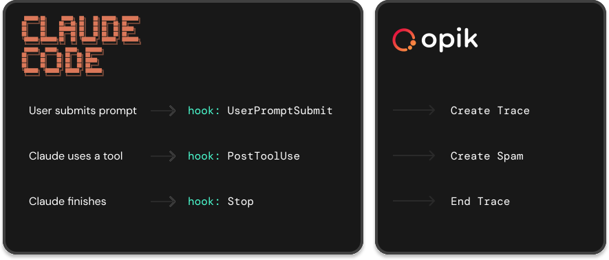

# Opik Claude Code Plugin

Log Claude Code sessions to [Opik](https://github.com/comet-ml/opik) for LLM observability, plus skills and agents for building observable AI applications.

## Features

- **Session Tracing**: Automatically log Claude Code sessions as Opik traces
- **Span Tracking**: Each tool call becomes a span within the trace
- **Subagent Support**: Nested agent calls are tracked with parent-child relationships
- **Skills**: Built-in knowledge for LLM observability, tracing, and evaluation
- **Agents**: Code review agent for agent architecture best practices

## How Tracing Works
We trigger tracing for everything done in Claude Code, but don't slow you down.



Each conversation turn becomes an Opik trace. Tool calls, thoughts, and responses become spans. Subagent invocations are nested under their parent Task span.

## Installation

From within Claude Code:

```
/plugin marketplace add comet-ml/opik-claude-code-plugin
```

Then install the plugin:

```
/plugin install opik
```

### Local Install (for contributors)

If you've cloned the repo locally, add it as a marketplace and install from there:

```
/plugin marketplace add /path/to/opik-claude-code-plugin
/plugin install opik
```

**Important:** Restart any running Claude Code sessions after installation. Hooks only load when a session starts.

### Enterprise Install (Managed Settings)

For org-wide deployment, drop a [Claude Code managed-settings.json](https://code.claude.com/docs/en/settings) on every user's machine via your MDM. Managed settings override user/project settings and let an admin enable the plugin, point it at an org-owned Opik workspace, and route every user to their own project automatically.

**Path on each platform:**

| Platform | Path |
|---|---|
| macOS | `/Library/Application Support/ClaudeCode/managed-settings.json` |
| Linux/WSL | `/etc/claude-code/managed-settings.json` |
| Windows | `C:\Program Files\ClaudeCode\managed-settings.json` |

**Example `managed-settings.json`:**

```json
{
  "extraKnownMarketplaces": {
    "opik": {
      "source": {"source": "github", "repo": "comet-ml/opik-claude-code-plugin"},
      "autoUpdate": true
    }
  },
  "enabledPlugins": {
    "opik@opik": true
  },
  "env": {
    "OPIK_CC_TRACING_ENABLED": "true",
    "OPIK_BASE_URL": "https://www.comet.com/opik/api",
    "OPIK_CC_WORKSPACE": "your-org-cc-workspace",
    "OPIK_API_KEY": "<workspace-scoped API key>",
    "OPIK_CC_PROJECT": "cc-{username}"
  }
}
```

What each piece does:

- `extraKnownMarketplaces` + `enabledPlugins` — registers the marketplace and force-enables the plugin for every user. Users see it as **managed** and can't disable it.
- `OPIK_CC_TRACING_ENABLED=true` — turns tracing on for every session without users dropping per-project files. Individual projects can still opt out by writing `off` to `.claude/.opik-tracing-enabled`.
- `OPIK_CC_WORKSPACE` — sends Claude Code traces to a dedicated workspace, isolated from any user's personal Opik work in `~/.opik.config`.
- `OPIK_API_KEY` — the workspace-scoped key the hook uses to write traces. Treat this file as sensitive; the API key is shared with every machine it's deployed to. Provision a key with the minimum write scope on the CC workspace.
- `OPIK_CC_PROJECT` — supports `{field}` tokens that expand from the user's Claude Code OAuth identity (read from `~/.claude.json`). So one config string routes every user to their own project.

**Available `{field}` tokens:**

| Token | Resolves to |
|---|---|
| `{username}` | local-part of email (before `@`) — e.g. `collinc` |
| `{email}` / `{user_email}` | full email — e.g. `collinc@comet.com` |
| `{user_uuid}` | Anthropic account UUID |
| `{display_name}` | OAuth display name |
| `{org_name}` | Anthropic organization name |
| `{org_uuid}` | Anthropic organization UUID |

Unknown tokens pass through literally so misconfigurations are visible in Opik rather than silently producing empty project names.

Per-trace identity (`cc.identity.user_email`, `cc.identity.user_uuid`, `cc.identity.org_uuid`, etc.) is also attached to every trace's metadata regardless of project name, plus a `user:<email>` tag, so admins can filter/group across users in a shared project too.

## Configuration

Run the Opik CLI to configure your connection:

```bash
pip install opik
opik configure
```

This creates `~/.opik.config` with your API URL, key, and workspace.

### Optional Environment Variables

```bash
export OPIK_CC_TRACING_ENABLED="true"       # Org-wide enable, useful from managed settings
export OPIK_CC_PROJECT="my-project"         # Project name (default: claude-code); supports {field} tokens — see Enterprise Install
export OPIK_CC_WORKSPACE="my-workspace"     # Workspace override (default: OPIK_WORKSPACE / ~/.opik.config)
export OPIK_CC_TRUNCATE_FIELDS="false"      # Don't truncate large fields
```

All plugin env vars use the `OPIK_CC_` prefix to avoid conflicts with standard Opik SDK variables.

`OPIK_CC_WORKSPACE` and `OPIK_CC_PROJECT` let you send Claude Code traces to a different
workspace/project than the rest of your Opik setup, without touching the global
`OPIK_WORKSPACE` / `project_name` in `~/.opik.config` used by the Opik SDK. Both can also be
set in `~/.opik.config` via the plugin-scoped `cc_workspace` and `cc_project` keys:

```ini
[opik]
workspace = my-sdk-workspace      # used by the Opik SDK
project_name = my-sdk-project     # used by the Opik SDK
cc_workspace = my-cc-workspace        # used only by the Claude Code plugin
cc_project_name = my-cc-project       # used only by the Claude Code plugin
```

> Note: for backward compatibility, if `cc_project_name` is not set the plugin still falls back
> to the shared `project_name` key.

### External Trace Linking

Link Claude Code sessions to existing Opik traces (useful for embedding Claude Code in larger workflows):

```bash
export OPIK_CC_PARENT_TRACE_ID="your-trace-id"  # Attach to existing trace
export OPIK_CC_ROOT_SPAN_ID="your-span-id"      # Set parent span for all Claude Code spans
```

## MCP Server Setup

The [Opik MCP server](https://github.com/comet-ml/opik-mcp) provides Claude with tools to interact with your Opik data - query traces, analyze experiments, and access evaluation results directly in conversation.

### For Opik Cloud

Add to your `~/.claude.json`:

```json
{
  "mcpServers": {
    "opik": {
      "command": "npx",
      "args": ["-y", "opik-mcp", "--apiKey", "YOUR_OPIK_API_KEY"]
    }
  }
}
```

Replace `YOUR_OPIK_API_KEY` with your API key from [comet.com](https://www.comet.com).

### For Self-Hosted Opik

```json
{
  "mcpServers": {
    "opik": {
      "command": "npx",
      "args": ["-y", "opik-mcp", "--apiBaseUrl", "http://localhost:5173/api"]
    }
  }
}
```

Adjust the `apiBaseUrl` to match your Opik instance.

### Pre-configured Templates

Copy-ready configurations are available in `mcp-configs/mcp-servers.json`.

## Commands

### `/opik:trace-claude-code` - Claude Code Session Tracing

Enable/disable automatic tracing of your Claude Code sessions to Opik.

```
/opik:trace-claude-code start                 # Enable tracing for this project
/opik:trace-claude-code start --debug         # Enable tracing + debug logging
/opik:trace-claude-code stop                  # Disable tracing for this project
/opik:trace-claude-code status                # Check project + global + effective state

/opik:trace-claude-code start --global        # Enable tracing for all projects
/opik:trace-claude-code stop --global         # Disable tracing globally
```

Tracing state is stored in `.claude/.opik-tracing-enabled` (project) or `~/.claude/.opik-tracing-enabled` (global). Resolution order (first match wins):

1. Project file containing `off`/`disabled` → **disabled** (opt a single project out of a global enable)
2. Project file present → **enabled** (`debug` content also enables debug logging)
3. Global file present → **enabled** (same content rules)
4. Neither → **disabled**

So the project setting always takes precedence over the global one. Running `stop` in a project while global tracing is on writes the `off` opt-out for that project rather than removing the global enable.

**Note:** Changes take effect immediately for new conversation turns (no restart needed).

### `/opik:instrument` - Add Observability to Your Code

Automatically detect frameworks in your code and add the correct Opik integration.

```
/opik:instrument my_agent.py        # Add tracing to a specific file
/opik:instrument                    # Analyze current context and add tracing
```

Supports automatic detection and integration for:
- **Python:** OpenAI, Anthropic, LangChain, LlamaIndex, CrewAI, Bedrock, Groq, LiteLLM
- **TypeScript:** OpenAI, LangChain, Vercel AI SDK
- **Custom code:** Adds `@opik.track` decorators or `Opik` client usage

The command ensures tracing starts at your entry point (critical for replay capability) and uses the correct span types.

## Skills

### `/opik:agent-ops` - LLM Observability Knowledge

Comprehensive guidance on:
- Opik setup and configuration
- Tracing with Python/TypeScript SDKs
- 80+ framework integrations (LangChain, CrewAI, OpenAI, Anthropic, etc.)
- Evaluation with 41 built-in metrics
- Production monitoring, guardrails, and debugging

## Agents

### `agent-reviewer`

Reviews agent code for:
- Idempotence and retry safety
- Security vulnerabilities
- Architecture patterns
- State management
- Observability hooks

## Directory Structure

```
opik-claude-code-plugin/
├── .claude-plugin/
│   ├── plugin.json         # Plugin manifest
│   └── marketplace.json    # Marketplace definition
├── hooks/
│   └── hooks.json          # Hook configuration
├── scripts/
│   └── opik-logger         # Platform selector script
├── bin/
│   └── opik-logger-*       # Compiled binaries (darwin/linux, amd64/arm64)
├── src/
│   └── *.go                # Go source code
├── skills/
│   └── agent-ops/          # Observability skill + references
├── agents/
│   └── agent-reviewer.md   # Agent review agent
├── commands/
│   ├── trace-claude-code.md  # /opik:trace-claude-code command
│   └── instrument.md         # /opik:instrument command
└── mcp-configs/
    └── mcp-servers.json    # MCP server configurations
```

## Building from Source

```bash
make build        # Build for all platforms
make build-local  # Build for current platform only
```
